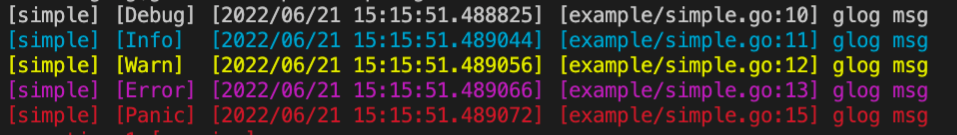

### About

一款能够应付日常开发的简单异步日志库。

### Feature

- [x] 格式化日志输出
- [x] 日志缓冲区大小可配置
- [x] 异步执行日志文件切割
- [x] 日志缓冲区flush周期可配置
- [x] 异步记录日志(终端采用同步输出)
- [x] 默认不输出日志文件 
- [x] 日志输出级别可配置(默认全部日志)
- [x] 配置项可选, 可根据自己的需求选择不同Option进行初始化
- [x] 日志级别划分: Panic(异常, 可以捕获), Fatal(致命错误), Error(错误), Warn(警告), Info(流水), Debug(调试信息)
- [x] 控制台使用颜色对不同级别的日志进行区分: Panic(红色), Fatal(红色), Error(紫红色), Warn(黄色), Info(蓝色), Debug(白色)
- [x] 提供不同的日志记录方式: WriteByLevel(区分级别记录在不同的文件), WriteByMerged(所有日志记录在一起), WriteByAll(既区分级别同时也记录在同一个文件)
- [x] 多种日志文件切割周期

### Usage

```go
import (
	"github.com/franklihub/glog"
)

func main() {
	msg := "glog msg"

	glog.Debug(msg)
	glog.Info(msg)
	glog.Warn(msg)
	glog.Error(msg)
	// glog.Fatal(msg)
	glog.Panic(msg)
}
```



